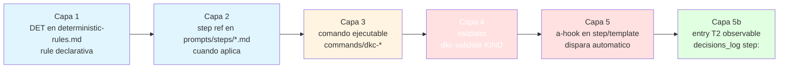

# Auditoria operacional del workflow DKC — contrato de enforcement de 5 capas + validators faltantes

# Auditoria operacional del workflow DKC — contrato de enforcement de 5 capas + validators faltantes

## Executive summary — lo que estas aprobando

> Este spec es **output de explore**, no se implementa directo. Define el catalogo de gaps detectados y propone un roadmap de tickets follow-up priorizados. El dev decide cuales activar como improvements/fixes separados.

**Que se quiere**: cerrar el gap operacional entre el contrato declarativo de DKC (DETs, a-hooks, references en steps) y su capa de implementacion ejecutable (`commands/`). El audit confirmo que el problema reportado por el dev ("LLM se salta pasos y escribe formato divergente") tiene un diagnostico preciso: **el patron de enforcement de 5 capas funciona cuando esta completo, pero 13 de 17 validators referenciados en a-hooks NO existen**, lo que vacia la capa ejecutable y deja el contrato como advisory-only.

**Diferencia con HOR-015** (audit estructural cerrado 2026-05-10): HOR-015 ataco peso/asimetria/granularidad/sync — capa de diseño. HOR-065 ataca la implementacion empirica del diseño tras 50 tickets — capa operacional.

**Decisiones criticas que necesitan tu OK**:

| # | Decision | Por que importa |
|---|----------|----------------|
| 1 | El diagnostico principal es "implementacion incompleta", no "diseño fallido" — el patron de 5 capas (DET + comando + validator + a-hook + entry T2) funciona en DET-29; falta replicarlo | Cambia la naturaleza del trabajo: NO se necesita rediseñar el flujo, se necesita completar lo que ya esta diseñado. Esto baja el SP estimado de los follow-ups significativamente |
| 2 | Priorizar implementacion de validators faltantes por **referencias en a-hooks** (impacto observable) en vez de por completitud teorica del schema. Top 7 priorizados en tabla abajo | Sin priorizacion, el dev podria empezar por los mas faciles (Bug, Decision) en vez de los mas impactantes (Ticket, StatusCoherence, AntiPatterns) — orden incorrecto deja gaps criticos abiertos |
| 3 | Tratar el bug de parsing YAML inline (`Unexpected token {` en SessionBlock con frontmatter `teachings: { ... }`) como prerequisite — sin esto, los validators existentes tambien fallan en tickets nuevos | El bug afecta TODOS los tickets post-2026-05-09 (cuando DET-21/22 introdujo `teachings`). Lo que hoy "valida" probablemente esta arrojando exit 3 para muchos tickets |
| 4 | NO mergear con HOR-059 (context reduction) — son ortogonales. Documentar coordinacion en backlog de cada uno | Si se mergea, el ticket explota a >13 SP y el alcance pierde foco. Mejor 2 tickets independientes que avanzan en paralelo |
| 5 | Mantener autopilot/teach off por default en los follow-ups TIPO `fix` o `improvement` de validators (work mecanico, baja necesidad de teach) | Reduce friccion y SP. Para los follow-ups tipo `architecture` (extender DET-29 a otros gates) si vale teach on |

**Riesgos principales y como los mitigamos**:

- **Implementar validators sin tests dispara cascada de breakage cuando a-hooks empiezan a bloquear**: los a-hooks que hoy fallan silencioso son advisory-only; al hacerlos reales, tickets historicos pueden empezar a fallar validacion → usar `--no-strict` por default en validators nuevos durante warmup; promover a strict tras 5+ tickets validados sin issues
- **Bug de parsing YAML inline puede esconder otros bugs en el lib zod actual**: antes de agregar validators, hacer audit ligero del `commands/lib/` para asegurar baseline solido → REQ-FIX-VALIDATOR-PARSE primero (prerequisite de todos los demas)
- **El patron de 5 capas tiene 6+ artefactos por DET (rule + step ref + command + validator + a-hook + entry T2) — costo de mantenimiento crece linealmente con N DETs**: aceptar y formalizar como costo del sistema. NO inventar abstraccion para reducirlo (premature) — esperar a 35+ DETs antes de evaluar
- **Coordinacion con HOR-059 puede dilatarse**: si HOR-059 cierra rapido (~1-2 semanas), HOR-065 follow-ups deberian arrancar despues para aprovechar context reducido. Si HOR-059 se estanca, NO bloquear a HOR-065

**Que NO se hace en este spec output**:

- **No se implementa nada** — es explore, produce roadmap. Los tickets follow-up tienen su propio ciclo
- **No se proponen cambios al schema zod core** mas alla de los 13 validators faltantes — refactor del lib es scope distinto
- **No se hace inventario exhaustivo de los 25 steps** — el grep sistematico capturado en HOR-065 S1 ya cubre la asimetria; documentado en L5
- **No se ataca el drift especifico de HOR-015/058/060** (specs in_progress con tickets closed) — el validator StatusCoherence cubrira la prevencion futura; resolver casos historicos es decision editorial del dev (probablemente "close estos 3 specs y registrar como decision local")
- **No se modifica `~/.claude/CLAUDE.md` global** — esa parte ya fue cubierta por HOR-015

**Tamano estimado del roadmap completo de follow-ups**: ~12-18 SP distribuidos en 4-6 tickets independientes. NINGUN ticket individual deberia superar 5 SP.

**Como vas a saber que funciona** (criterios observables del roadmap completo, no de este spec):

- Ejecuto `dkc-validate Ticket projects/horadric/tickets/HOR-XXX.md` y NO obtengo "Unexpected token" — devuelve `valid` o `invalid` con detalle
- Cuando el LLM intenta cerrar un ticket sin propagar status al spec → a-hook StatusCoherence dispara y bloquea
- Cuando el LLM escribe una session en formato no canonico (tabla en vez de checkboxes) → a-hook AntiPatterns detecta y reporta antes del commit
- Los specs in_progress con tickets closed se vuelven imposibles (validator bloquea la transicion `closed` del ticket sin propagar)

---

## Purpose

Cerrar el gap entre el contrato declarativo de DKC y su capa de implementacion ejecutable, mediante (a) implementacion de los 13 validators referenciados en a-hooks pero no existentes en `dkc-validate`, priorizados por impacto, (b) fix del bug de parsing YAML inline en el lib zod actual, (c) extension del patron DET-29 (in-flight persistence) a otros gates criticos del flujo.

Audiencia: dev del meta-sistema DKC + cualquier LLM ejecutor que opere sobre tickets DKC. El beneficio: el contrato declarativo gana capacidad de bloquear (no solo advertir), y los formatos divergentes producidos por el LLM se detectan antes de quedar persistidos en KB.

## Analisis de mejora

### Estado actual (medido durante HOR-065 S1, 2026-05-23)

**Validators implementados** (4 kinds + `all`):

| Kind | Existe | Schema |
|------|--------|--------|
| `SpecTask` | si | zod en `commands/lib/` — HOR-026 |
| `SessionBlock` | si (con bug de parsing) | zod — HOR-026 |
| `Rule` | si | zod — HOR-041 |
| `Decision` | si | zod — HOR-041 |

**Validators referenciados en a-hooks pero NO existentes** (13 kinds):

| Kind | Referenciado en | Prioridad |
|------|-----------------|-----------|
| `Ticket` | `templates/records/ticket.md:414` (a-hook estandar de ticket completo) | **alta** — afecta todo intake/close |
| `StatusCoherence` | Mencionado en `templates/records/ticket.md:8` (frontmatter docstring HOR-061 M2 conditional) | **alta** — previene drift spec/ticket |
| `AntiPatterns` | `intake-explore.md` GATE 2 (cat-9-B2 antipattern) | **alta** — bloquea anti-patrones HOR-062 |
| `SessionExecution` | `request-execute.md`, DET-29 verification | **alta** — gate de batch-transition detection |
| `StepTransition` | a-hooks varios — propagacion entre steps | **media** — coherencia transversal |
| `SessionCheckboxes` | a-hooks de gate D (per-task transition) | **media** — HOR-056 capa B enforcement |
| `StepDecisions` | a-hooks HOR-058 T2 — entries `step:` en decisions_log | **media** — auditoria T2 |
| `Teach` | a-hooks teach-intake/close | media — gate DET-21/22 (skippable) |
| `Draft` | a-hooks design-draft | media — gate DET-18 (conditional) |
| `MetaSpec` | a-hooks design-from-metaspecs | baja — uso ocasional |
| `SpecFull` | a-hooks design-* | baja — mayormente cubierto por SpecTask |
| `Bug` | a-hooks bugs/ | baja — bugs raros en proyectos activos |
| `Transcript` | a-hooks transcript-extract | baja — feature opcional |

**Bug critico del validator existente**:

- `dkc-validate SessionBlock <ticket>.md` falla con `Unexpected token {` cuando el frontmatter contiene YAML inline (`teachings: { intake: skipped, close: skipped }`, `teachings_skip_reason: { intake: "...", close: "..." }`). Afecta TODOS los tickets post-2026-05-09 (introduccion de DET-21/22) — es decir, la mayoria del KB actual.

**Distribucion de invocaciones a commands DKC por step** (verificada en S1, ver L5 del ticket):

| Step | Count `commands/dkc-*` | Notas |
|------|------------------------|-------|
| request-execute | 39 | mejor cubierto (DET-29 + verify-gate + record-decision + validate + write) |
| request-close | 22 | bien cubierto |
| _design-shared | 8 | shared lib OK |
| teach-intake | 6 | OK |
| request-intake | 4 | aceptable |
| intake-explore | 4 | aceptable |
| teach-close, design-draft | 3 cada uno | aceptable |
| design-{feature,fix,improvement,refactor,transition-to-execute,from-metaspecs} | 1 cada uno | minimo aceptable |
| transcript-extract | 1 | aceptable |
| **0 invocaciones** | validate-templates, update-template, transcript-recall, teach, reindex, init-*, archive-spec | 11 steps. Algunos legitimos (reindex, init-*), pero archive-spec y validate-templates son gaps reales |

**Drift estructural observado**: 3 specs `in_progress` con tickets `closed` (HOR-015, HOR-058, HOR-060). Sin StatusCoherence validator, este patron se repetira indefinidamente.

### Problema / oportunidad

Cuando el LLM ejecuta un step DKC, el a-hook que deberia bloquear divergencia de formato o salto de paso apunta a un validator que **NO existe**, por lo tanto el a-hook falla silenciosamente y el cambio se persiste igual al KB. Resultado observable:

1. Tickets cierran con sessions en formato no canonico (tabla en vez de checkboxes) — HC parser miss → session aparece vacia
2. Specs quedan in_progress mientras su ticket cierra — drift de status no detectado
3. A-hooks listados en templates dan sensacion de "esta cubierto" pero son advisory-only
4. El dev/LLM aprende a confiar en a-hooks que en realidad no bloquean → erosion progresiva del contrato

La oportunidad: el patron de 5 capas (DET + comando + validator + a-hook + entry T2) ya esta probado en DET-29. Solo hace falta replicarlo de manera disciplinada para los 13 validators faltantes.

### Estado deseado

**Validators implementados**: todos los 17 referenciados en a-hooks existen y funcionan (no fallan con bugs de parsing).

**A-hooks productivos**: cuando un a-hook se dispara, retorna exit code coherente (0/1/2/3) que el sistema puede usar para bloquear o advertir. Tickets en KB tienen probabilidad ≥95% de pasar `dkc-validate all` sin error tecnico (exit 3).

**Coherencia spec/ticket**: `dkc-validate StatusCoherence` se invoca como sub-paso de `request-close.md` y `archive-spec.md`. Sin esto, el cierre no se persiste.

**Anti-patrones de formato bloqueados al escribir**: cuando el LLM intenta persistir una session con shape no canonico (tabla, `## Plan` paralelo, etc.), el a-hook AntiPatterns dispara antes de quedar persistido.

**Patron de 5 capas formalizado**: introducir RULE-workflow-enforcement-pattern-009 (o similar) que documente el patron como contrato para futuras DETs. Cada nueva DET MUST listar sus 5 artefactos antes de declararse activa.

## Requirements

### REQ-FIX-VALIDATOR-PARSE-01: parsing del frontmatter con YAML inline

> **Que cambia**: el comando `dkc-validate SessionBlock <ticket>` deja de fallar con "Unexpected token {" cuando el frontmatter contiene YAML inline tipo `teachings: { intake: skipped, ... }`.
> **Por que**: hoy bloquea validacion en la mayoria del KB post-2026-05-09. Es prerequisito de todo lo demas — sin esto, los validators que SI existen tampoco son confiables.

El sistema MUST parsear correctamente frontmatter YAML que use sintaxis inline (`field: { key: value }`) sin fallar con error de tokenizacion.

**Actor**: developer DKC
**Layers**: backend (lib zod parser)

Scenarios de validacion

- **GIVEN** un ticket con frontmatter `teachings: { intake: skipped, close: skipped }` **WHEN** se ejecuta `dkc-validate SessionBlock <ticket>.md` **THEN** el parser procesa el campo sin error tecnico **AND** retorna exit 0 (valid) o 1 (invalid con detalle) — NO exit 3 (error tecnico)
- **GIVEN** un ticket con frontmatter `teachings_skip_reason: { intake: "razon con quotes", close: "..." }` **WHEN** se ejecuta el validator **THEN** parsea el string con quotes correctamente

### REQ-IMPROVE-VALIDATORS-CORE-02: implementar validators core priorizados (top 7)

> **Que cambia**: los 7 validators de prioridad **alta+media** se implementan en `dkc-validate` con schema zod equivalente al patron HOR-026/041.
> **Por que**: hoy son advisory-only. Implementarlos los convierte en gates reales que bloquean divergencia antes de persistir al KB.

El sistema MUST aceptar los siguientes kinds adicionales en `dkc-validate`: `Ticket`, `StatusCoherence`, `AntiPatterns`, `SessionExecution`, `StepTransition`, `SessionCheckboxes`, `StepDecisions`.

**Actor**: developer DKC + LLM ejecutor (via a-hooks)
**Layers**: backend (validators), config (a-hook references), workflow (steps que invocan)

Scenarios de validacion

- **GIVEN** los 7 validators implementados **WHEN** un a-hook los invoca **THEN** retornan exit code coherente (0/1/2) — NO exit 3
- **GIVEN** `dkc-validate Ticket <path>` **WHEN** el ticket tiene secciones faltantes (no completo) **THEN** retorna exit 1 con detalle de secciones faltantes
- **GIVEN** `dkc-validate StatusCoherence <ticket-or-spec>` **WHEN** el ticket esta `closed` pero el spec referenciado esta `in_progress` **THEN** retorna exit 1 con mensaje "drift spec/ticket: status incoherente"
- **GIVEN** `dkc-validate AntiPatterns <ticket>` **WHEN** una session usa tabla markdown en vez de lista de checkboxes para tasks **THEN** retorna exit 1 con detalle del anti-patron (cat-9-B2)

### REQ-IMPROVE-VALIDATORS-AUX-03: implementar validators auxiliares (prioridad baja)

> **Que cambia**: los 6 validators de prioridad baja (`Teach`, `Draft`, `MetaSpec`, `SpecFull`, `Bug`, `Transcript`) se implementan despues de los core.
> **Por que**: cubrir el contrato completo del a-hook layer. Los core son los criticos; estos 6 son cleanup.

El sistema SHOULD aceptar los 6 kinds restantes en `dkc-validate` despues de completar REQ-IMPROVE-VALIDATORS-CORE-02.

**Actor**: developer DKC
**Layers**: backend (validators)

### REQ-IMPROVE-ENFORCEMENT-PATTERN-04: formalizar el patron de 5 capas

> **Que cambia**: se introduce RULE-workflow-enforcement-pattern-009 que documenta el patron canonico: DET (capa 1) + step ref (capa 2) + comando ejecutable (capa 3) + validator (capa 4) + a-hook (capa 5) + entry T2 en `decisions_log` (capa 5b verifiable).
> **Por que**: sin la rule formal, futuras DETs heredaran el problema actual (capa 4 = vacia). La rule fuerza a listar las 5 capas como contrato.

El sistema MUST tener una rule que documente el patron y MUST verificar que toda DET nueva especifica sus 5 artefactos en la seccion "Verification" de la propia DET.

**Actor**: developer DKC + LLM scribe al crear DETs
**Layers**: meta (rules, prompts)

### REQ-IMPROVE-EXTEND-DET29-05: extender patron in-flight a otros gates

> **Que cambia**: el patron DET-29 (`dkc-execute-task` con sub-comandos init/open/start/done) se aplica equivalentemente a `intake-close` y `design-close`. Comandos nuevos: `dkc-finalize-intake`, `dkc-finalize-design` (o equivalentes via extension de `dkc-execute-task`).
> **Por que**: el problema "LLM cierra step sin propagar" se observa no solo en execute (DET-29) sino tambien en intake (caso L1 = 3 specs in_progress) y design. Replicar el patron resuelve la propagacion sistemica.

El sistema MAY introducir commands equivalentes a `dkc-execute-task` para cierre de intake y design — siempre y cuando el costo de mantenimiento (6+ artefactos por nuevo gate) este justificado por incidencias historicas.

**Actor**: developer DKC + LLM ejecutor
**Layers**: backend (commands), workflow (steps)

**Nota**: este REQ es `MAY` (no `MUST`) porque su justificacion depende de cuanto se reduce el sintoma con REQ-IMPROVE-VALIDATORS-CORE-02 sola. Si los validators de StatusCoherence + StepTransition resuelven la propagacion, REQ-05 puede diferirse.

### REQ-PRESERVE-VALIDATORS-01: validators existentes no se rompen

> **Que cambia**: los 4 validators existentes (`SpecTask`, `SessionBlock`, `Rule`, `Decision`) mantienen su comportamiento actual + fix del bug de parsing.
> **Por que**: regression. Tickets historicos validados con estos schemas deben seguir validando despues de los cambios.

El sistema MUST mantener compatibilidad con los validators actuales. Cambios solo son fix (REQ-FIX-VALIDATOR-PARSE-01), no rediseño.

**Actor**: developer DKC
**Layers**: backend (lib zod)

### REQ-PRESERVE-AHOOKS-02: a-hooks existentes no se modifican

> **Que cambia**: los a-hooks existentes en steps/templates mantienen su sintaxis actual. Solo se modifican aquellos que apuntan a validators inexistentes — implementando el validator destino, no cambiando el a-hook.
> **Por que**: cambiar a-hooks impactaria tickets historicos. Implementar el validator destino es accion aditiva, segura.

El sistema MUST preservar la sintaxis actual de los a-hooks. La accion correctiva es agregar el validator faltante, no modificar el a-hook.

**Actor**: developer DKC
**Layers**: prompts/templates

## Diagrama del patron de enforcement de 5 capas

**Estado actual**: capa 4 (validator) tiene **gap de 13/17 = 76% no implementado**. Las otras capas estan presentes pero pierden eficacia sin la capa 4.

## Roadmap de tickets follow-up

| # | Ticket sugerido | Tipo | Prioridad | SP estimado | Depende de | Que cubre |
|---|-----------------|------|-----------|-------------|------------|-----------|
| F1 | HOR-XXX — fix parser YAML inline en dkc-validate lib | fix | **must** | 1-2 | — | REQ-FIX-VALIDATOR-PARSE-01 |
| F2 | HOR-XXX — implementar validators core (Ticket + StatusCoherence + AntiPatterns + SessionExecution + StepTransition + SessionCheckboxes + StepDecisions) | improvement | **must** | 5-8 | F1 | REQ-IMPROVE-VALIDATORS-CORE-02 |
| F3 | HOR-XXX — implementar validators auxiliares (Teach + Draft + MetaSpec + SpecFull + Bug + Transcript) | improvement | should | 3-5 | F2 | REQ-IMPROVE-VALIDATORS-AUX-03 |
| F4 | HOR-XXX — formalizar patron enforcement de 5 capas (RULE + actualizar template DET) | improvement | should | 1-2 | F2 | REQ-IMPROVE-ENFORCEMENT-PATTERN-04 |
| F5 | HOR-XXX — extender DET-29 a intake-close + design-close | improvement | could | 3-5 | F2, F4 | REQ-IMPROVE-EXTEND-DET29-05 |
| F6 | HOR-XXX — cleanup retroactivo de 3 specs in_progress con ticket closed (HOR-015, HOR-058, HOR-060) | quick | could | <1 | F2 (StatusCoherence) | Decision editorial del dev sobre cada uno |

**Orden recomendado de ejecucion**: F1 → F2 → (F3 paralelo a F4) → F5 (si justifica) → F6.

**Total estimado**: 13-21 SP (rango por incertidumbre). Mediana ~15 SP. Distribuir en 2-3 sprints.

## Constraints

- Schema zod existente (`commands/lib/`) usa Node 18+. Validators nuevos deben usar mismo runtime (no introducir Python ni Rust)
- Tests existentes de validators (`SpecTask`, `SessionBlock`) son baseline — no romper
- `dkc-validate` mantiene su API CLI actual (`{kind} {file} [--session N] [--no-strict]`); validators nuevos pueden agregar flags propios pero no romper el shape
- A-hooks usan sintaxis HTML comment con regex literal — no introducir variantes nuevas

## Dependencies

- HOR-026 (output schemas zod) — base del lib
- HOR-041 (extension schemas Rule + Decision) — patron a replicar
- HOR-046 (state SoT + tipado contratos DKC↔HC) — convencion de errores
- HOR-058 (enforcement T2) — convencion de entries observables en `decisions_log`
- HOR-059 (context budget reduction) — ortogonal, coordinar timing

## Risks

| Riesgo | Probabilidad | Impacto | Mitigacion |
|--------|--------------|---------|------------|
| Implementar validators desencadena cascade de failures en tickets historicos | media | alto | Usar `--no-strict` por default los primeros N tickets; promover a strict tras warmup |
| Bug de parsing YAML inline esconde otros bugs en lib zod | baja | medio | Audit ligero del lib en F1 antes de agregar validators |
| Costo mantenimiento del patron de 5 capas crece linealmente | alta | bajo | Aceptar como costo del sistema; revisar abstraccion solo si pasa 35+ DETs |
| HOR-059 (context reduction) cambia las premisas durante el roadmap | media | bajo | F2 puede arrancar sin esperar HOR-059. Coordinar en sprint planning |

## Open questions

- ¿F5 (extender DET-29 a otros gates) se justifica o lo cubre F2 con StepTransition + StatusCoherence? — decidir al cierre de F2 con evidencia empirica
- ¿F6 (cleanup retroactivo de 3 specs) se hace como tickets individuales o como decision local en cada spec? — decision editorial del dev

## Acceptance

Este spec output del explore se considera aprobado cuando:

- El dev confirma el roadmap F1-F6 (puede eliminar/agregar/reordenar)
- El dev decide cuales follow-ups activar inmediatamente (probablemente F1 + F2)
- El ticket HOR-065 cierra con status `closed`, `closed_reason: explored`, spec output queda en `draft`

Este spec NO se promueve a `done` — explore termina con spec draft. Si los follow-ups completan los REQs, alguno de ellos (probablemente F2) marca el spec como `done` al cierre.
