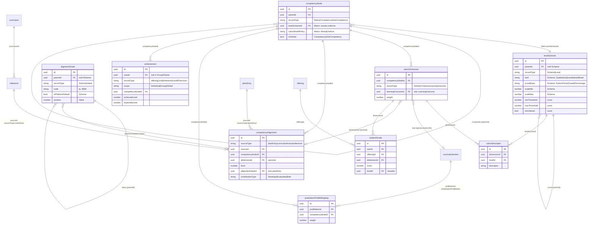
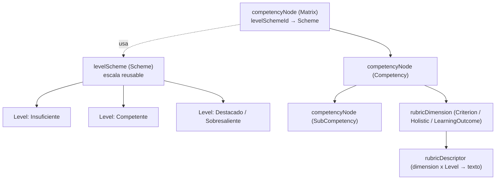
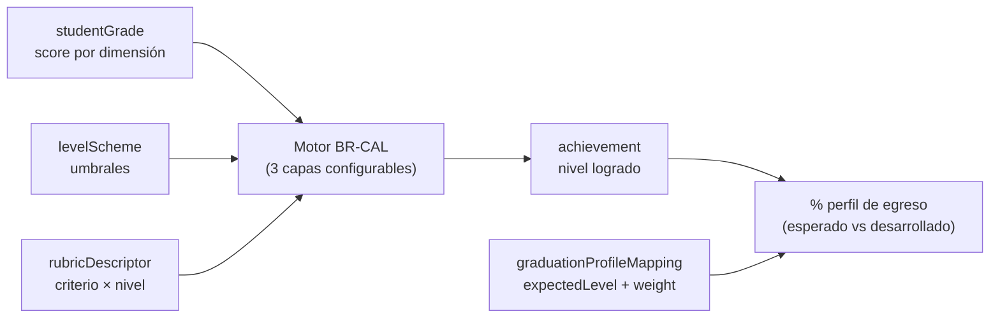

# Gestión de competencias en uP1 - propuesta de modelo (para refinamiento de implementación)

> **Propósito.** Diseño objetivo del modelo de gestión de competencias para la migración de uAssessment a uP1. Documento autocontenido para refinar la implementación: incluye el detalle técnico completo de todos los objetos (existentes y nuevos), esquemas de estructura y relaciones, y ejemplos funcionales que cubren todos los casos que el modelo permite representar.
>
> **Alcance.** Capa C (Competencias / Mapeo) y lo relacionado de evaluación y logro (Capa D).
>
> **Encuadre.** El modelo legacy de uAssessment (tablas `imp_*`) es **solo referencial**: sirve para no perder ningún concepto del dominio, no como plano a copiar. La propuesta unifica y simplifica lo que en legacy vive fragmentado. Todos los objetos de este dominio están hoy en estado **Draft** (diseño); en producción existen como objetos legacy `uc*`.

---

## 1. Principios de diseño (qué mejora respecto de legacy)

Legacy resuelve el dominio pero con tres defectos que esta propuesta corrige:

1. **Tres modelos paralelos** (Competencia pura, Competencia-RA, Competencia-Criterios) con familias de tablas distintas. **Propuesta:** un solo modelo de rúbrica configurable por un discriminador de "qué se evalúa" (`rubricDimension.recordType`).
2. **Rúbrica dispersa** en ~6 tablas y **duplicada** en capa de curso y de sección. **Propuesta:** rúbrica en dos objetos coherentes (`rubricDimension` + `rubricDescriptor`), definida una vez y **heredada** (MADS) a la oferta, sin copia.
3. **Doble noción de nivel** (holístico de la competencia + umbrales por criterio) y **score fijo 0-4**. **Propuesta:** una sola noción de nivel (la del esquema), escala configurable y agregación configurable.

Cuatro preocupaciones se separan como objetos independientes y reusables:

| Preocupación | Objeto(s) | Reusable |
|---|---|---|
| La escala de medición | `levelScheme` | Sí, entre matrices |
| El árbol de competencias | `competencyNode` | Sí, institucional |
| La rúbrica (qué se evalúa + descriptor por nivel) | `rubricDimension` + `rubricDescriptor` | Por competencia |
| La evidencia y el logro | `studentGrade` + `achievement` | Por estudiante |

Tributación (`competencyAlignment`) conecta currículo con competencia y es ortogonal al cumplimiento booleano (`requirement`): aprobar un curso es evidencia de competencia, no la competencia.

---

## 2. Esquemas del modelo (estructura y relaciones)

### 2.1 Diagrama entidad-relación



### 2.2 Jerarquía Composite (qué cuelga de qué)



### 2.3 Flujo de evidencia a logro



> Nota: los diagramas están en Mermaid. Si el documento se publica a Confluence, se convierten a imagen (Confluence del workspace no renderiza Mermaid).

---

## 3. Objetos - detalle técnico completo

Convención: los objetos marcados **(existe)** ya están en el modelo consolidado (§ indicada); **(nuevo)** son altas de esta propuesta; **(corregido)** cambian respecto del draft.

### 3.1 `levelScheme` (existe, corregido) - la escala reusable

Composite. Escala de niveles de logro; una o varias matrices la comparten. **No contiene criterios** (corrección: en el draft los criterios colgaban del nivel; se mueven a la competencia).

| Campo | Tipo | Req | Notas |
|---|---|---|---|
| id | UUID | si | PK |
| recordType | string | si | `Scheme` / `Level` |
| name | string | si | |
| code | string | si | Único dentro del esquema |
| description | string? | no | |
| position | number | si | Orden |
| ownerType | enum {institution} | si (Scheme) | Scope institucional |
| ownerId | UUID | si (Scheme) | |
| createdAt / updatedAt | DateTime | si | |

**Campos por RecordType**

| RecordType | Campo | Tipo | Req | Notas |
|---|---|---|---|---|
| `Scheme` (raíz) | kind | enum | si | `Qualitative` / `Quantitative` / `Mixed` |
| | scoreBasis | enum | cond (kind != Qualitative) | **Qué representa el número**: `RubricPoints` (puntaje de rúbrica) / `Grade` (nota/calificación) / `Percentage`. Es el control "puntaje vs nota" |
| | scaleMin | number | cond (kind != Qualitative) | Piso del dominio numérico (ej. 0, 1) |
| | scaleMax | number | cond (kind != Qualitative) | Techo del dominio numérico (ej. 4, 7, 100). Los `Level.min/maxThreshold` deben caer en `[scaleMin, scaleMax]` y cubrirlo sin huecos ni solapes |
| | isPlatformDefault | boolean | si (def false) | Esquema base de plataforma, inmutable |
| `Level` | parentId | UUID | si | FK -> levelScheme (Scheme). **Único RT con `parentId`** |
| | weight | number | si | Peso del nivel para agregación |
| | isAchieved | boolean | si | Si el nivel cuenta como "logrado" |
| | minThreshold | number? | cond | Solo `kind` Quantitative/Mixed |
| | maxThreshold | number? | cond | Solo `kind` Quantitative/Mixed |

> `Scheme` no tiene workflow ni estado (catálogo institucional; control por inmutabilidad/versionado). Rangos de `Level` sin solape ni huecos.

**Significado funcional de `kind`** (cómo se decide el nivel de logro):

| `kind` | Qué expresa | Cómo se determina el nivel | Umbrales `min/max` | Descriptores (`rubricDescriptor`) |
|---|---|---|---|---|
| **Qualitative** | La escala es **ordinal por evidencia**: el logro se juzga observando el desempeño contra descriptores, sin nota numérica. | El evaluador **asigna** el nivel comparando el desempeño con el descriptor de cada nivel. | No se usan | **Obligatorios** (son la base del juicio) |
| **Quantitative** | La escala es **numérica**: el logro se deriva automáticamente de una calificación. | El `score` del estudiante **cae** en el rango (`min-max`) de un `Level` y ese es el nivel. | **Obligatorios** | Opcionales (informativos) |
| **Mixed** | Combina ambas: hay **corte numérico y** descripción observable por nivel. | El `score` resuelve el nivel por umbral **y** cada nivel tiene su descriptor (para rúbrica y reportería). | **Obligatorios** | **Obligatorios** |

- **Qualitative** - típico de competencias actitudinales/procedimentales, rúbricas observacionales, sello valórico, prácticas: no hay "nota", el docente marca Insuficiente/Competente/... según lo que observa.
- **Quantitative** - típico cuando el logro sale directo de la calificación (ej. escala 0-100 -> 3 niveles): el nivel es un mapeo automático de la nota, sin texto de rúbrica obligatorio.
- **Mixed** - el caso más completo (ej. hito de enfermería): se puntúa por criterio (0-4, resuelve el nivel por umbral) **y** cada celda criterio x nivel tiene su descriptor de desempeño esperado. Es el que habilita rúbrica analítica + cálculo automático a la vez.

El `kind` condiciona las validaciones de la matriz al publicar (ver §5): `Quantitative` exige umbrales completos sin solape; `Qualitative` exige descriptores en cada nivel usado; `Mixed` exige ambos.

**`scoreBasis` + `scaleMin/scaleMax` (base de medición del número, solo Quantitative/Mixed).** `kind` dice **si** hay número; `scoreBasis` dice **qué es ese número** (puntaje de rúbrica, nota/calificación o porcentaje) y `scaleMin/scaleMax` **en qué dominio vive**. Sin esto, un umbral `2.0-2.9` es ambiguo (¿0-4? ¿1-7? ¿0-100?). Con esto los umbrales son unívocos y validables al publicar.

Esto es lo que **resuelve la medición heterogénea entre facultades**: la base no es un flag global de la institución, vive en cada `levelScheme`. Facultad de Salud puede usar un esquema `scoreBasis=RubricPoints [0-4]` y Facultad de Ingeniería uno `scoreBasis=Grade [1.0-7.0]` para sus respectivas competencias; ambas conviven en la misma institución. La homologación se hace al capturar la evidencia (`studentGrade` normaliza al dominio del esquema, ver §3.8), no forzando a todos a la misma escala.

### 3.2 `competencyNode` (existe) - el árbol de competencias

Composite. La `Matrix` referencia el `levelScheme` (escala) y fija la política de modelo de rúbrica.

> **Qué es uniforme en una matriz y qué no** (regla central del modelo):
> - **La escala de logro (`levelScheme`) es única para toda la matriz** (`Matrix.levelSchemeId`). Es lo que hace los logros comparables y agregables: el perfil de egreso solo puede fijar `expectedLevel` por competencia si todas hablan la misma escala. Escalas distintas -> matrices distintas.
> - **El modelo de rúbrica (`rubricDimension.recordType`: Holistic / Criterion / LearningOutcome) puede variar por competencia** dentro de la misma matriz. Una competencia valórica es `Holistic`, una técnica `Criterion`, una alineada a RA `LearningOutcome`; conviven en una matriz porque todas resuelven contra la misma escala. El motor agrega a nivel de `Level`, no de decomposición, así que mezclar modelos no rompe el roll-up.
> - El flag `rubricModelPolicy` permite a la institución **forzar uniformidad** de modelo si lo desea (`Uniform`), pero el default es `Mixed` (flexible).

| Campo | Tipo | Req | Notas |
|---|---|---|---|
| id | UUID | si | PK |
| parentId | UUID? | no | FK -> competencyNode. `null` = raíz (Matrix) |
| recordType | string | si | `Matrix` / `Competency` / `SubCompetency` |
| name | string | si | |
| code | string | si | ej. "CE1" |
| description | string? | no | |
| position | number | si | |
| externalId | string? | no | |
| metadata | JSON? | no | Params por institución |
| createdAt / updatedAt | DateTime | si | |

(los campos propios de cada RecordType - `levelSchemeId`, `matrixType`, `status`, `isHolistic` - van en la tabla "Campos por RecordType" de abajo.)

**Campos por RecordType**

| RecordType | Campo | Tipo | Req | Notas |
|---|---|---|---|---|
| `Matrix` (raíz) | levelSchemeId | UUID | si | FK -> levelScheme (Scheme). **Escala única de toda la matriz** (uniforme) |
| | matrixType | enum | si | Generic / Transversal / Specific / Professional / International |
| | rubricModelPolicy | enum | si (def `Mixed`) | Política de modelo de rúbrica: `Mixed` (cada competencia elige su `recordType`) / `Uniform` (todas deben usar el mismo modelo). Ver nota abajo |
| | status | enum | no | Máquina de estados por enum + `transitions` (ver abajo). `static_default=Draft` |
| `Competency` | parentId | UUID | si | FK -> competencyNode (Matrix) |
| | isHolistic | boolean | si (def false) | `true` = sin hijos; se evalúa como un todo |
| `SubCompetency` | parentId | UUID | si | FK -> competencyNode (Competency **o** SubCompetency; árbol de N niveles) |
| | isHolistic | boolean | si (def false) | `true` = sin hijos (nodo hoja) |

> `isHolistic` se almacena en `Competency` y `SubCompetency` (opción 2): debe mantenerse coherente con el árbol (`true` si el nodo no tiene hijos `competencyNode`). Se guarda en ambos para soportar árboles de N niveles (una subcompetencia puede desglosarse en sub-subcompetencias).

> Aclaración: `isHolistic` (nodo sin hijos; aplica a `Competency` y `SubCompetency`) es distinto del `rubricDimension` tipo `Holistic` (competencia evaluada como un todo, una sola dimensión). Un nodo puede ser `isHolistic=true` y aun así tener rúbrica por criterios.

**Máquina de estados de la Matrix (motor de enum, UPONE-1381).** Reemplaza el workflow relacional viejo (`currentStatusId` -> `WorkflowStatus`, retirado). El campo `status` declara las transiciones permitidas en el propio objeto; `enforceEnumTransitions` las valida en `updateInstance`, con capability por arista y `requiresComment` opcional (metadata leída por el MCP). Competency/SubCompetency no tienen `status` propio (heredan el de su Matrix).

```json
"status": {
  "type": "string",
  "enum": ["Draft", "InReview", "Approved", "Active", "Deprecated", "Archived"],
  "static_default": "Draft",
  "transitions": [
    { "from": "Draft",      "to": "InReview" },
    { "from": "InReview",   "to": "Approved",   "requiredCapabilities": ["competencynode:approve"] },
    { "from": "InReview",   "to": "Draft",      "requiresComment": true },
    { "from": "Approved",   "to": "Active",     "requiredCapabilities": ["competencynode:publish"] },
    { "from": "Approved",   "to": "Draft" },
    { "from": "Active",     "to": "Deprecated", "requiredCapabilities": ["competencynode:deprecate"], "requiresComment": true },
    { "from": "Active",     "to": "Draft",      "requiredCapabilities": ["competencynode:revert"],    "requiresComment": true },
    { "from": "Deprecated", "to": "Archived",   "requiredCapabilities": ["competencynode:archive"] }
  ]
}
```

> Mismo patrón que `activity`/`Curriculum` en `develop` (UPONE-1381). Solo la **Matrix** lleva `status`; `levelScheme`, `rubricDimension`, `rubricDescriptor`, `studentGrade` y `achievement` **no** tienen máquina de estados (catálogo / datos / snapshot inmutable).

### 3.3 `rubricDimension` (nuevo) - qué se evalúa

Composite, hijo de `competencyNode(Competency/SubCompetency)`. Unificación de los tres modelos de competencia según su `recordType`.

| Campo | Tipo | Req | Notas |
|---|---|---|---|
| id | UUID | si | PK |
| competencyNodeId | UUID | si | FK -> competencyNode (competencia dueña) |
| recordType | string | si | `Holistic` / `Criterion` / `LearningOutcome` |
| code | string | si | Único dentro de la competencia |
| name | string | si | |
| description | string? | no | |
| weight | number | si | Peso de la dimensión en el roll-up de la competencia |
| position | number | si | Orden |
| createdAt / updatedAt | DateTime | si | |

(el campo propio `learningOutcomeId` va en la tabla "Campos por RecordType" de abajo.)

**Campos por RecordType** (los tres modelos como configuración)

| RecordType | Modelo que cubre | Cardinalidad | Campo propio |
|---|---|---|---|
| `Holistic` | Competencia pura | 1 por competencia | (ninguno; usa campos base) |
| `Criterion` | Competencia-Criterios | N por competencia | (ninguno; usa campos base) |
| `LearningOutcome` | Competencia-RA | N por competencia | `learningOutcomeId` (UUID, si) - FK -> curricularSection(LearningOutcome) |

Reglas de modelo:
- **Dentro de una competencia** las dimensiones son de un solo `recordType` (no se mezclan Holistic con Criterion en la misma competencia).
- **Entre competencias de una matriz** el `recordType` puede variar libremente (default `rubricModelPolicy=Mixed`). Si la matriz es `rubricModelPolicy=Uniform`, todas las competencias deben usar el mismo `recordType`; se valida al publicar (§5).

### 3.4 `rubricDescriptor` (nuevo) - la celda de rúbrica

Texto de desempeño por combinación dimensión x nivel.

| Campo | Tipo | Req | Notas |
|---|---|---|---|
| id | UUID | si | PK |
| dimensionId | UUID | si | FK -> rubricDimension |
| levelId | UUID | si | FK -> levelScheme (Level) |
| descriptor | string | si | Evidencia observable del desempeño en ese nivel |
| position | number | no | |
| createdAt / updatedAt | DateTime | si | |

Restricción: único por `(dimensionId, levelId)`. Obligatorio para esquemas cualitativos/mixtos; opcional para cuantitativos puros.

### 3.5 `competencyAlignment` (existe) - tributación

Conecta un elemento del currículo con una competencia (relación polimórfica).

| Campo | Tipo | Req | Notas |
|---|---|---|---|
| id | UUID | si | PK |
| sourceType | enum | si | `planEntry` / `curricularSection` / `milestone` |
| sourceId | UUID | si | FK polimórfica según sourceType |
| competencyNodeId | UUID | si | FK -> competencyNode |
| dimensionId | UUID? | no | Tributación fina a una dimensión (criterio/RA) específica |
| level | number? | no | Nivel al que tributa; para milestone = nivel esperado |
| alignmentValueId | UUID? | no | Solo planEntry. FK -> `alignmentScale`(Value). Escala de cobertura **configurable** (default I/R/M). Reemplaza el enum fijo `intensity` |
| contributionType | enum | no | `Develops` / `Evaluates` / `Both` (enum fijo; solo planEntry) |
| createdAt | DateTime | si | |

**Dos ejes independientes** (solo `sourceType=planEntry`, es decir tributación curso -> competencia). Se separan a propósito porque tienen naturalezas distintas:

- **`contributionType`** {`Develops` / `Evaluates` / `Both`} - **eje funcional, enum fijo de plataforma**. Es casi universal (todas las IES distinguen "enseñar" de "medir"), así que se hardcodea:
  - `Develops` (desarrolla): el curso **forma/enseña** la competencia pero no la mide formalmente.
  - `Evaluates` (evalúa): el curso **mide** la competencia y genera **evidencia de logro** (`studentGrade` -> `achievement`).
  - `Both`: hace ambas.
  - Consecuencia en el motor: **solo `Evaluates`/`Both` producen logro** (`achievement`); un `Develops` puro contribuye a la formación y a la cobertura, pero no a la medición.
- **`alignmentValueId`** -> `alignmentScale`(Value) - **eje de cobertura, escala configurable por institución**. Expresa en qué punto de la progresión el curso aborda la competencia (el clásico Introduce/Reinforce/Master). **No es un enum fijo**: cada IES usa su propia convención (I/R/M, I/D/E/M, 1-3, Bajo/Medio/Alto...), por lo que hardcodearlo impondría una definición institucional. Se modela como catálogo reusable (mismo patrón que `levelScheme`) con un **default de plataforma = I/R/M**. Es **analítico**: alimenta el heatmap de cobertura curricular (curso x competencia) y la detección de brechas/solapamientos; por sí solo no cambia el cálculo de logro.

> Regla de diseño: lo **universal y funcional** (¿enseña o mide?) es enum fijo; lo **institucional y variable** (con qué escala se mapea la cobertura) es catálogo configurable. Ver §3.5b.

Para `sourceType = curricularSection` (RA/evaluación) o `milestone`, `alignmentValueId`/`contributionType` no aplican; `curricularSection(EvaluationComponent)` alineado a una competencia es evidencia de evaluación por naturaleza.

**Mejora:** reemplaza las múltiples tablas de alineación por contexto de legacy con una relación polimórfica, y saca la escala de cobertura del enum hardcodeado.

### 3.5b `alignmentScale` (nuevo) - escala de cobertura configurable

Composite. Catálogo institucional reusable de la escala con que un curso tributa a una competencia (cobertura curricular). Reemplaza el enum fijo que traía `intensity`, para no imponer una convención institucional en el modelo. La plataforma trae un **default = I/R/M** (Introduce / Reinforce / Master, la convención estándar de acreditación); cada institución puede definir la suya. Mismo patrón Composite que `levelScheme`; **sin workflow ni estado** (es catálogo).

**Campos base** (comunes a ambos RecordTypes):

| Campo | Tipo | Req | Notas |
|---|---|---|---|
| id | UUID | si | PK |
| recordType | string | si | `Scheme` / `Value` |
| name | string | si | Scheme: nombre de la escala (ej. "Cobertura curricular"). Value: nombre del valor (ej. "Introduce") |
| code | string | si | Scheme: código de la escala (ej. `IRM`). Value: código del valor (ej. `I`). Único dentro de su padre |
| description | string? | no | Texto de ayuda; en Value, cuándo usar ese grado de cobertura |
| position | number | si | Scheme: orden entre escalas. Value: orden en la progresión (I=1, R=2, M=3) |
| ownerType | enum {institution} | si (Scheme) | Scope institucional |
| ownerId | UUID | si (Scheme) | Institución dueña de la escala |
| createdAt / updatedAt | DateTime | si | |

**Campos por RecordType:**

| RecordType | Campo | Tipo | Req | Notas |
|---|---|---|---|---|
| `Scheme` (raíz) | isPlatformDefault | boolean | si (def false) | Marca la escala base de plataforma (I/R/M); inmutable, no editable ni borrable por la institución |
| | isActive | boolean | si (def true) | Permite retirar una escala institucional sin borrarla (no seleccionable en nuevas tributaciones) |
| `Value` | parentId | UUID | si | FK -> `alignmentScale`(Scheme). **Único RT con `parentId`** |

> `Scheme` no tiene workflow ni estado (catálogo institucional; control por `isActive` e inmutabilidad del default). Un `Value` no se referencia si su `Scheme` está inactivo. La institución puede tener 0..N escalas propias; si no define ninguna, se usa el default de plataforma.

**Default de plataforma (Scheme `code=IRM`, `name="Cobertura curricular"`, `isPlatformDefault=true`):**

| position | code | name | description |
|---|---|---|---|
| 1 | I | Introduce | El curso presenta la competencia por primera vez; primer contacto |
| 2 | R | Reinforce | El curso profundiza/practica una competencia ya introducida |
| 3 | M | Master | El curso lleva la competencia a nivel de dominio esperado al egreso |

Referenciado por `competencyAlignment.alignmentValueId` (solo `sourceType=planEntry`).

### 3.6 `graduationProfileMapping` (existe) - binding perfil ↔ competencia

Enlaza un item narrativo del perfil de egreso con una competencia de la matriz.

| Campo | Tipo | Req | Notas |
|---|---|---|---|
| id | UUID | si | PK |
| profileItemId | UUID | si | FK -> curricularSection (GraduationProfileItem) |
| competencyNodeId | UUID | si | FK -> competencyNode |
| weight | number | si | Ponderación de agregación; suma 100 por dueño del perfil |
| createdAt | DateTime | si | |

**Decisión:** `expectedLevel` vive en el item del perfil (Design); `weight` (agregación) vive aquí. El logro del perfil solo es medible tras el mapping.

### 3.7 `curricularSection` - RecordTypes de perfil de egreso (existe)

El perfil de egreso narrativo vive como RecordTypes de `curricularSection` con `ownerType=curriculum`.

**GraduationProfile** (contenedor narrativo, 1 por currículo):

| Campo | Tipo | Req | Notas |
|---|---|---|---|
| narrativeIntro | string? | no | Texto del perfil |
| isLinkedToCompetencyProfile | boolean | no (def false) | Flag: si está vinculado a matriz de competencias |
| lastReviewDate | string? | no | ISO 8601 |

**GraduationProfileItem** (cada competencia/desempeño del perfil):

| Campo | Tipo | Req | Notas |
|---|---|---|---|
| competencyLabel | string | si | Texto libre (Design; sin competencyNode) |
| description | string? | no | |
| expectedLevel | string/number | si | Nivel esperado al egreso (debe pertenecer al esquema de la matriz cuando hay mapping) |
| position | number | si | |

(más campos base de `curricularSection`: `ownerType=curriculum`, `ownerId`, `recordType`, `name`, `sectionType`, `parentId`.)

### 3.8 `studentGrade` (existe, enriquecido) - evidencia

Calificación al grano de dimensión de rúbrica.

| Campo | Tipo | Req | Notas |
|---|---|---|---|
| id | UUID | si | PK |
| userId | UUID | si | FK -> core_User |
| offeringId | UUID | si | FK -> offering |
| evaluationComponentId | UUID? | no | FK -> curricularSection (EvaluationComponent, ownerType=offering) |
| dimensionId | UUID | si | FK -> rubricDimension (enriquecimiento propuesto) |
| rawValue | number? | cond | Valor **en la escala nativa de la evaluación** (ej. 84, o 6.0). Requerido si el nivel se resuelve por número |
| sourceScaleMax | number? | cond | Techo de la escala nativa (ej. 100, 7.0). Junto a `rawValue` describe de dónde vino |
| sourceScaleType | enum? | no | Base nativa: `RubricPoints` / `Grade` / `Percentage`. Traza la homologación |
| normalizedValue | number? | cond | `rawValue` **mapeado al dominio (`scoreBasis`/`scaleMin`-`scaleMax`) del `levelScheme` de la competencia**. Es el ÚNICO valor que el motor compara contra los umbrales |
| levelId | UUID? | no | Nivel resuelto por umbral sobre `normalizedValue` (o asignado por evidencia si kind=Qualitative) |
| isOverride | boolean | si (def false) | |
| overrideReason | string? | no | |
| source | enum | si | Manual / SIS / LMS / Calculated |
| externalId | string? | no | |
| createdAt / updatedAt | DateTime | si | |

**Homologación en captura (esto es lo que habilita el multi-facultad).** Al registrar evidencia se guarda `rawValue` en la escala nativa de la evaluación y se calcula `normalizedValue` en el dominio del `levelScheme` de la competencia. Ejemplos:
- Evaluación en nota 1.0-7.0 → competencia con esquema `RubricPoints [0-4]`: `rawValue=6.0, sourceScaleMax=7` → `normalizedValue = (6.0-1)/(7-1) * 4 = 3.33`.
- Evaluación en 0-100 → competencia con esquema `Percentage [0-100]`: `rawValue=84` → `normalizedValue=84` (misma base, sin transformación).

Si `scoreBasis=Grade` y la escala nativa ya es esa nota, `normalizedValue = rawValue` (no se transforma). El motor **siempre** lee `normalizedValue`; nunca compara `rawValue` crudo contra umbrales.

### 3.9 `achievement` (existe) - logro (snapshot inmutable)

| Campo | Tipo | Req | Notas |
|---|---|---|---|
| id | UUID | si | PK |
| userId | UUID? | no | `null` si scope = Group/Global |
| recordType | string | si | `offeringLevel` / `milestoneLevel` / `PlanLevel` |
| scope | enum | si | Individual / Group / Global |
| competencyNodeId | UUID | si | FK -> competencyNode (Competency/SubCompetency) |
| achievedLevel | number | si | Nivel alcanzado |
| expectedLevel | number? | no | Del perfil vía graduationProfileMapping (PlanLevel) |
| calculatedAt | DateTime | si | |
| createdAt | DateTime | si | Sin `updatedAt` (inmutable) |

**Campos por RecordType**

| RecordType | Campo propio | Tipo | Req | Notas |
|---|---|---|---|---|
| `offeringLevel` | offeringId | UUID | si | Contexto: al cerrar una sección/oferta |
| `milestoneLevel` | milestoneId | UUID | si | Contexto: al activarse un hito |
| `PlanLevel` | curriculumId | UUID | si | `expectedLevel` viene de GraduationProfileItem vía graduationProfileMapping |

Propuesta: agregar `levelSchemeId` + `schemeVersion` (campos base) para trazabilidad de acreditación.

### 3.10 `milestone` (existe) - hito de medición

| Campo | Tipo | Req | Notas |
|---|---|---|---|
| id | UUID | si | PK |
| curriculumId | UUID | si | FK -> curriculum |
| name | string | si | |
| position | number | si | Orden en la progresión |
| createdAt / updatedAt | DateTime | si | |

Ancla de `competencyAlignment (sourceType=milestone)` y contexto de `achievement (milestoneLevel)`. Su disparador es un `requirement(ownerType=milestone)`.

---

## 4. Motor de cálculo del logro (configurable)

Tres capas, con perfiles predefinidos (Estándar, ABET, CBE), configurable por institución:

1. **Dimensión -> nivel:** el `normalizedValue` (ya homologado al dominio del esquema, §3.8) cae en el `minThreshold/maxThreshold` de un `Level` (cuantitativo/mixto), o el nivel se asigna por evidencia (cualitativo).
2. **Dimensiones -> competencia:** agregación a la competencia. Modos: máximo, promedio ponderado (usa `rubricDimension.weight`), último, progresivo, mejor N de M.
3. **Competencia -> perfil:** contra `expectedLevel` y `weight` del `graduationProfileMapping`; produce % esperado y % desarrollado.

Un `achievement` se emite (y se re-emite si cambian datos) por capa según el `scope`.

---

## 5. Ciclo de vida y gobernanza

- **La matriz** (`competencyNode` Matrix) usa el **motor de transiciones por enum de core** (UPONE-1381): un campo `status` (enum) con las `transitions` declaradas en el propio objeto, validadas por `enforceEnumTransitions` en `updateInstance`, con capability por arista + `requiresComment` opcional, y `DataLog` de auditoría. **No** el workflow relacional viejo (`WorkflowStatus`, retirado). Estados: Draft -> InReview -> Approved -> Active -> Deprecated/Archived.
- **El `levelScheme` NO tiene workflow ni estado**: es un catálogo institucional; su control es la inmutabilidad/versionado tras uso.
- **Inmutabilidad tras uso / versionado:** cambiar niveles o umbrales de un esquema en uso genera versión nueva; los `achievement` referencian la versión con que se calcularon.
- **Publicación de matriz:** gate de completitud de rúbrica (cada dimensión con descriptor en cada nivel usado, salvo cuantitativo puro).
- **Coherencia de escala numérica:** si el `levelScheme` es `Quantitative`/`Mixed`, los `Level.min/maxThreshold` deben cubrir `[scaleMin, scaleMax]` sin huecos ni solapes; `scoreBasis` debe estar definido. Esto se valida al publicar el esquema, no en cada evaluación.
- **Política de modelo de rúbrica:** si la matriz es `rubricModelPolicy=Uniform`, todas sus competencias deben compartir el mismo `rubricDimension.recordType`; se valida al publicar la matriz. Con `Mixed` (default) no hay restricción.

---

## 6. Casos funcionales (todos los que el modelo permite)

Cada caso muestra las **instancias completas** de los objetos (campo = valor) para poder analizarlas contra el modelo de §3. Los `id` son didácticos (no UUID reales). Campos base omitidos por brevedad salvo cuando importan.

**Escalas de niveles de ejemplo (`levelScheme`) reutilizadas por los casos:**

```
LS-4MIX   levelScheme(Scheme)  kind=Mixed   scoreBasis=RubricPoints  scaleMin=0  scaleMax=4   name="Escala 4 niveles"
  Level  Insuficiente   position=1  isAchieved=false  minThreshold=0.0  maxThreshold=1.9
  Level  Competente     position=2  isAchieved=true   minThreshold=2.0  maxThreshold=2.9
  Level  Destacado      position=3  isAchieved=true   minThreshold=3.0  maxThreshold=3.4
  Level  Sobresaliente  position=4  isAchieved=true   minThreshold=3.5  maxThreshold=4.0

LS-4QUAL  levelScheme(Scheme)  kind=Qualitative  (sin scoreBasis)  name="Escala 4 niveles (cualitativa)"
  Level  Insuficiente/Competente/Destacado/Sobresaliente  (sin umbrales; descriptores obligatorios)

LS-100    levelScheme(Scheme)  kind=Quantitative  scoreBasis=Percentage  scaleMin=0  scaleMax=100  name="Escala 100"
  Level  Inicial     isAchieved=false  minThreshold=0   maxThreshold=59
  Level  Suficiente  isAchieved=true   minThreshold=60  maxThreshold=79
  Level  Avanzado    isAchieved=true   minThreshold=80  maxThreshold=100

LS-7NOTA  levelScheme(Scheme)  kind=Mixed  scoreBasis=Grade  scaleMin=1.0  scaleMax=7.0  name="Nota 1-7 (Ingeniería)"
  Level  Insuficiente position=1  isAchieved=false  minThreshold=1.0  maxThreshold=3.9
  Level  Suficiente   position=2  isAchieved=true   minThreshold=4.0  maxThreshold=5.4
  Level  Bueno        position=3  isAchieved=true   minThreshold=5.5  maxThreshold=6.4
  Level  Excelente    position=4  isAchieved=true   minThreshold=6.5  maxThreshold=7.0
```

**Escala de cobertura (`alignmentScale`)** usada en los casos con tributación: el default de plataforma `IRM` (I=Introduce, R=Reinforce, M=Master).

---

### Caso A - Competencia holística, escala cualitativa
**Situación:** sello valórico "Compromiso ético", evaluado como un todo por evidencia (sin nota numérica). Es el caso "Competencia pura" del legacy: una sola dimensión holística.

```
competencyNode(Matrix)      MTX-SELLO   name="Sello valórico"        status=Active   levelSchemeId=LS-4QUAL
competencyNode(Competency)  CE-ETICA    parentId=MTX-SELLO  name="Compromiso ético"  isHolistic=true

rubricDimension(Holistic)   DIM-ETICA   competencyNodeId=CE-ETICA   weight=1.0
  (dimensión única -> no hay agregación entre dimensiones; el nivel de la dimensión ES el de la competencia)

rubricDescriptor  dimensionId=DIM-ETICA  levelId=Insuficiente   descriptor="Incumple normas éticas básicas."
rubricDescriptor  dimensionId=DIM-ETICA  levelId=Competente     descriptor="Actúa con integridad en situaciones habituales."
rubricDescriptor  dimensionId=DIM-ETICA  levelId=Destacado      descriptor="Anticipa dilemas éticos y fundamenta decisiones."
rubricDescriptor  dimensionId=DIM-ETICA  levelId=Sobresaliente  descriptor="Promueve la cultura ética en su entorno."
```

**Evaluación (docente asigna nivel por evidencia, no hay score):**
```
studentGrade   dimensionId=DIM-ETICA   levelId=Destacado   rawValue=null   assignedBy=evidence   (kind=Qualitative: sin número)
```
**Motor:** kind=Qualitative -> el nivel se toma directo de la evidencia; no hay umbral.
**Resultado:**
```
achievement   competencyNodeId=CE-ETICA   scope=offeringLevel   levelId=Destacado   schemeVersion=LS-4QUAL@v1
```

---

### Caso B - Competencia por criterios, escala mixta, medida en hito
**Situación:** Enfermería (Santo Tomás), CE1 "Aplica el proceso de atención de enfermería", con 3 criterios ponderados, evaluada en el hito integrador SAL00034.

```
competencyNode(Matrix)      MTX-ENF   name="Especialidad Enfermería"   status=Active   levelSchemeId=LS-4MIX
competencyNode(Competency)  CE1       parentId=MTX-ENF  name="Aplica el proceso de atención de enfermería"  isHolistic=false

rubricDimension(Criterion)  CR1  competencyNodeId=CE1  name="Valora al paciente según patrones funcionales"  weight=0.4
rubricDimension(Criterion)  CR2  competencyNodeId=CE1  name="Formula diagnósticos NANDA"                     weight=0.3
rubricDimension(Criterion)  CR3  competencyNodeId=CE1  name="Ejecuta intervenciones seguras"                 weight=0.3
   (suma weight = 1.0)

rubricDescriptor  dimensionId=CR1  levelId=Competente     descriptor="Valora los patrones prioritarios con apoyo docente."
rubricDescriptor  dimensionId=CR1  levelId=Sobresaliente  descriptor="Valora integralmente los 11 patrones justificando con evidencia."
   (... una celda por cada CRx x cada Level ...)

milestone   SAL00034   curriculumId=CUR-ENF   name="Integrador clínico III"   position=6

competencyAlignment  sourceType=planEntry  sourceId=PE-ENF-ADULTO  competencyNodeId=CE1
                     contributionType=Evaluates   alignmentValueId=IRM:M   level=Sobresaliente
competencyAlignment  sourceType=milestone  sourceId=SAL00034       competencyNodeId=CE1   level=Sobresaliente
```

**Evaluación (score por criterio, escala 0-4):**
```
studentGrade  dimensionId=CR1  rawValue=3.5  sourceScaleType=RubricPoints  normalizedValue=3.5  milestoneId=SAL00034
studentGrade  dimensionId=CR2  rawValue=3.0  sourceScaleType=RubricPoints  normalizedValue=3.0  milestoneId=SAL00034
studentGrade  dimensionId=CR3  rawValue=2.5  sourceScaleType=RubricPoints  normalizedValue=2.5  milestoneId=SAL00034
```
**Motor:**
1. Dimensión -> nivel (por umbral LS-4MIX): CR1 3.5->Sobresaliente, CR2 3.0->Destacado, CR3 2.5->Competente.
2. Dimensiones -> competencia (promedio ponderado): `3.5*0.4 + 3.0*0.3 + 2.5*0.3 = 3.05` -> cae en [3.0-3.4] -> **Destacado**.

**Resultado:**
```
achievement  competencyNodeId=CE1  scope=milestoneLevel  milestoneId=SAL00034  levelId=Destacado  scoreValue=3.05  schemeVersion=LS-4MIX@v1
```

---

### Caso C - Competencia por resultados de aprendizaje (RA)
**Situación:** misma mecánica que B, pero las dimensiones **son RA existentes** (no criterios ad-hoc): el logro se alimenta de la evaluación de RA que ya existe, sin duplicar.

```
competencyNode(Competency)  CE7  name="Comunica resultados técnicos"  isHolistic=false  levelScheme(matriz)=LS-4MIX

rubricDimension(LearningOutcome)  DIM-RA1  competencyNodeId=CE7  learningOutcomeId=RA-OUT-101  weight=0.5   name="Redacta informes técnicos"
rubricDimension(LearningOutcome)  DIM-RA2  competencyNodeId=CE7  learningOutcomeId=RA-OUT-102  weight=0.5   name="Expone oralmente con evidencia"
   (learningOutcomeId -> curricularSection(LearningOutcome) ya existente en el currículo)
```
**Evaluación:** el `studentGrade` de cada dimensión toma el resultado del RA correspondiente (`curricularSection`). Agregación idéntica a B.
**Nota de diseño:** los 3 modelos legacy (holística / criterios / RA) son el **mismo objeto** `rubricDimension` cambiando `recordType`; no hay 3 estructuras separadas.

---

### Caso D - Escala cuantitativa pura (sin rúbrica cualitativa)
**Situación:** el logro se deriva directo de una nota; no se exige texto de rúbrica.

```
competencyNode(Matrix)      MTX-X   levelSchemeId=LS-100  status=Active
competencyNode(Competency)  CE-Q    parentId=MTX-X  isHolistic=true
rubricDimension(Holistic)   DIM-Q   competencyNodeId=CE-Q  weight=1.0   (rubricDescriptor OPCIONAL)

studentGrade  dimensionId=DIM-Q  rawValue=84  sourceScaleType=Percentage  normalizedValue=84
```
**Motor:** 84 cae en [80-100] de LS-100 -> **Avanzado** (por umbral, sin descriptores).
```
achievement  competencyNodeId=CE-Q  scope=offeringLevel  levelId=Avanzado  scoreValue=84
```

---

### Caso E - Matriz transversal reusable compartiendo esquema
**Situación:** un sello institucional que todas las carreras miden sin recrear la competencia.

```
competencyNode(Matrix)      MTX-SELLO  name="Sello valórico institucional"  ownerType=institution  levelSchemeId=LS-4QUAL
   -> referenciada por CUR-ENF, CUR-ING, CUR-DER... (vía perfil / curriculumAssignment), sin re-crear CE-ETICA
```
- El mismo `levelScheme LS-4QUAL` lo comparten esta matriz y otras; la escala es reusable e independiente de la matriz.
- Un cambio en el descriptor del sello se propaga a todas las carreras que lo referencian (no hay copias divergentes).

---

### Caso F - Perfil de egreso con niveles esperados y pesos
**Situación:** el perfil de egreso fija, por competencia, el nivel esperado al egreso y su peso relativo.

```
curricularSection(GraduationProfile)      GP-ENF   curriculumId=CUR-ENF
curricularSection(GraduationProfileItem)  GPI-1  parentId=GP-ENF  narrative="El egresado aplica el proceso de enfermería..."
curricularSection(GraduationProfileItem)  GPI-2  parentId=GP-ENF  narrative="...gestiona el cuidado con seguridad..."

graduationProfileMapping  profileItemId=GPI-1  competencyNodeId=CE1  expectedLevel=Sobresaliente  weight=0.25
graduationProfileMapping  profileItemId=GPI-2  competencyNodeId=CE2  expectedLevel=Destacado      weight=0.20
graduationProfileMapping  profileItemId=GPI-3  competencyNodeId=CE3  expectedLevel=Competente     weight=0.15
   (... suma de weight del perfil = 1.0 ...)
```
**Regla:** `expectedLevel` debe pertenecer al `levelScheme` de la matriz de esa competencia.
**Reporte (motor capa 3):** por CE1, `achievement(Destacado)` vs `expectedLevel(Sobresaliente)` -> "no alcanza el esperado por 1 nivel"; el % desarrollado global pondera cada brecha por `weight`.

---

### Caso G - Flujo completo: tributación -> herencia MADS -> evaluación -> logro
**Situación:** encadena todos los objetos, desde el mapeo curricular hasta el reporte de perfil.

```
1. TRIBUTACIÓN
   competencyAlignment  sourceType=planEntry  sourceId=PE-ENF-ADULTO  competencyNodeId=CE1
                        contributionType=Both  alignmentValueId=IRM:R  level=Destacado
   (el curso "Enfermería del adulto" desarrolla Y evalúa CE1; cobertura = Reinforce)

2. HERENCIA MADS
   Activity(programa de CE1)  define la rúbrica canónica (CR1..CR3 + descriptores)
   Offering(sílabo)           hereda la rúbrica vía plantilla MADS  (NO copia; referencia con override opcional)

3. EVALUACIÓN EN SECCIÓN
   studentGrade  dimensionId=CR1  rawValue=3.2  sourceScaleType=RubricPoints  normalizedValue=3.2  offeringId=OFF-2026-1
   studentGrade  dimensionId=CR2  rawValue=3.0  sourceScaleType=RubricPoints  normalizedValue=3.0  offeringId=OFF-2026-1
   studentGrade  dimensionId=CR3  rawValue=3.4  sourceScaleType=RubricPoints  normalizedValue=3.4  offeringId=OFF-2026-1

4. LOGRO
   achievement  competencyNodeId=CE1  scope=offeringLevel  offeringId=OFF-2026-1  levelId=Destacado  scoreValue=3.19
   (al cerrar el hito SAL00034, el motor emite además achievement scope=milestoneLevel; y al egreso, scope=PlanLevel)

5. REPORTE DE PERFIL
   esperado(CE1)=Sobresaliente  vs  desarrollado(CE1)=Destacado  ->  brecha 1 nivel  (pondera por weight 0.25)
```
Nota: `contributionType=Both` implica que este curso **sí** produce `achievement`. Un curso con `contributionType=Develops` aparecería en la cobertura (heatmap I/R/M) pero no generaría `studentGrade`/`achievement`.

---

### Caso H - Subcompetencias anidadas medidas en hitos distintos
**Situación:** CE1 se descompone en dos subcompetencias progresivas evaluadas en hitos distintos; el logro de CE1 agrega el de sus hijas.

```
competencyNode(Competency)     CE1     parentId=MTX-ENF  isHolistic=false   (nodo con hijos -> NO tiene rúbrica propia)
competencyNode(SubCompetency)  CE1N1   parentId=CE1  name="Nivel intermedio"  isHolistic=true
competencyNode(SubCompetency)  CE1N2   parentId=CE1  name="Nivel avanzado"    isHolistic=true

rubricDimension(...)  para CE1N1  (evaluada en milestone SAL00021)
rubricDimension(...)  para CE1N2  (evaluada en milestone SAL00034)
```
**Motor (roll-up de árbol):**
1. `achievement(CE1N1)` y `achievement(CE1N2)` se calculan en sus hitos como en el Caso B.
2. `achievement(CE1)` agrega a sus subcompetencias (modo configurable: máximo / último / ponderado). Ej. modo "último" -> CE1 toma el nivel de CE1N2.

Regla de coherencia (§3.2): `isHolistic=true` solo en las hojas (CE1N1/CE1N2). CE1 tiene hijos -> `isHolistic=false` y no lleva `rubricDimension` propia; su nivel viene del roll-up.

---

### Caso I - Facultades que miden distinto (puntaje vs nota) en la misma institución
**Situación:** Salud evalúa sus competencias con **puntaje de rúbrica 0-4**; Ingeniería con **nota 1.0-7.0**. Ambas conviven; el `levelScheme` fija la base y `studentGrade` homologa.

```
# Facultad de Salud
competencyNode(Matrix)  MTX-ENF   levelSchemeId=LS-4MIX   (scoreBasis=RubricPoints [0-4])
studentGrade  dimensionId=CR1  sourceScaleType=RubricPoints  rawValue=3.5  sourceScaleMax=4   normalizedValue=3.5
   -> 3.5 en LS-4MIX -> Sobresaliente

# Facultad de Ingeniería
competencyNode(Matrix)  MTX-ING   levelSchemeId=LS-7NOTA  (scoreBasis=Grade [1.0-7.0])
studentGrade  dimensionId=CRx  sourceScaleType=Grade  rawValue=6.0  sourceScaleMax=7   normalizedValue=6.0
   -> 6.0 en LS-7NOTA -> Bueno
```

**Caso extra - una evaluación en escala nativa distinta a la del esquema** (curso que califica 0-100 tributando a una competencia con esquema de rúbrica 0-4):
```
levelScheme de la competencia = LS-4MIX (RubricPoints [0-4])
studentGrade  sourceScaleType=Percentage  rawValue=84  sourceScaleMax=100
              normalizedValue = 84/100 * 4 = 3.36   -> cae en [3.0-3.4] -> Destacado
```
- El reporte de acreditación es comparable entre facultades **a nivel de Level** (Sobresaliente / Bueno / Destacado...), no a nivel de número crudo: cada institución/facultad lee el logro en su propia escala pero el modelo mantiene la trazabilidad de `rawValue` original.
- Ninguna facultad tiene que renunciar a su forma de calificar; lo único común es que cada competencia declara su `levelScheme` y toda evidencia se homologa a él.

---

## 7. Mapeo referencial legacy -> uP1 (solo referencia)

| Concepto (uAssessment) | Tabla legacy | Objeto uP1 |
|---|---|---|
| Matriz | `imp_competencysets` | `competencyNode(Matrix)` |
| Competencia / subcompetencia | `imp_competencies` | `competencyNode(Competency/SubCompetency)` |
| Esquema de niveles | `imp_levelschemes` / `_levels` / `_level_thresholds` | `levelScheme(Scheme/Level)` |
| Criterios de la competencia | `imp_competencylevel_criteria` | `rubricDimension(Criterion)` |
| Descriptor por criterio x nivel | `imp_criteria_thresholds` | `rubricDescriptor` |
| Tributación | `imp_courses_competencies` (+ tablas por contexto) | `competencyAlignment` (polimórfico) |
| Escala de cobertura (I/R/M) | (hardcodeado / convención) | `alignmentScale` (catálogo configurable) |
| Score por criterio | `imp_student_scores` | `studentGrade` (grano dimensión) |
| Logro | `imp_competency_development` / `imp_milestone_attempt` | `achievement` |

uP1 **no replica** la duplicación curso vs sección (`imp_coursecomponent_criteria_levels` / `imp_sectioncomponent_criteria_levels`): la rúbrica se define una vez y se hereda por MADS.

---

## 8. Decisiones abiertas / supuestos (baseline aplicado)

1. **Unificación por `recordType` de dimensión** (Holistic/Criterion/LearningOutcome) reemplaza los 3 modelos legacy. Baseline: aplicado.
2. **Escala configurable** vía `levelScheme` (ordinal, numérica o mixta). Una matriz usa una escala; escalas distintas -> matrices distintas. Baseline: aplicado.
3. **Rúbrica canónica en la competencia** (institucional, reusable); Activity/Offering la referencian y heredan por MADS, con override solo si el caso lo exige. Baseline: aplicado.
4. **Versionado de esquema y matriz** (inmutable tras uso); el `achievement` guarda la versión. Baseline: aplicado.
5. **Agregación (roll-up)** con perfiles Estándar/ABET/CBE configurables. Pendiente: defaults por institución.
6. **Tributación fina** (`competencyAlignment.dimensionId`) opcional: pendiente confirmar si se usa desde el inicio o solo curso->competencia.
7. **Score en `studentGrade` al grano de dimensión**: enriquecimiento propuesto (el modelo actual llega a `evaluationComponent`); confirmar.
8. **Escala de cobertura configurable** (`alignmentScale`) con default de plataforma I/R/M en vez de enum hardcodeado; `contributionType` se mantiene como enum fijo. Baseline: aplicado. Pendiente: confirmar si en F3 se habilita override institucional o solo el default.
9. **Base de medición por esquema, no global** (`scoreBasis` + `scaleMin/scaleMax` en `levelScheme`; homologación en `studentGrade`): habilita que facultades midan distinto (puntaje de rúbrica vs nota) conviviendo en la misma institución. Baseline: aplicado. Pendiente: definir catálogo de reglas de normalización soportadas (lineal por defecto; ¿tabla de equivalencia por tramos?).
10. **Escala uniforme por matriz, modelo de rúbrica libre por competencia.** La escala (`levelScheme`) es única en la matriz (comparabilidad); el modelo de rúbrica (`recordType`) varía por competencia salvo que la matriz sea `rubricModelPolicy=Uniform`. Baseline: aplicado (default `Mixed`).

---

## 9. Alcance de implementación sugerido (fases)

- **F1 - Fundaciones:** `levelScheme` (Scheme/Level) + `alignmentScale` (Scheme/Value, default I/R/M) + `competencyNode` operativos con CRUD, workflow y defaults de plataforma.
- **F2 - Rúbrica:** `rubricDimension` + `rubricDescriptor` + editor de rúbrica (grid dimensión x nivel) para los 3 recordTypes.
- **F3 - Perfil y tributación:** `graduationProfileMapping` (expectedLevel + weight) + `competencyAlignment`.
- **F4 - Evidencia y logro:** `studentGrade` por dimensión + motor BR-CAL + `achievement` (individual, luego grupal/global).
- **F5 - Reportería:** logro por dimensión y % esperado/desarrollado del perfil; evidencia para acreditación.

Cada fase es demoable y deja objetos operables vía API y MCP (misma política que el resto del mod).
